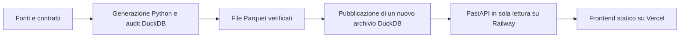

# Itadb

Una popolazione sintetica italiana, interrogabile ed esplorabile, con fonti,
assunzioni e verifiche consultabili. Gli individui non corrispondono a persone reali.

Il riferimento corrente comprende **58.943.464 individui e 26.670.169 famiglie**
in 7.896 comuni, con riferimento demografico 1° gennaio 2025.
L'ordine del modello è **sesso/età → geografia → cittadinanza → famiglie**.
I margini osservati ammessi sono conservati; l'incrocio età–singola cittadinanza
e la composizione familiare sono sintetici. [Metodo e limiti](docs/population.md).

## Architettura

**DuckDB è l'unico database. Python prepara i dati e serve le API; React mostra il prodotto.**



Parquet è il formato dei file generati. La cartografia viene preparata con
l'estensione `spatial` di DuckDB; il servizio legge GeoJSON già pronti.
Generazione e pubblicazione sono comandi locali, separati dalle richieste web.
Ogni archivio è immutabile, verificato e ripristinabile. [Architettura](docs/architecture.md).

La web app offre **Esplora**, con mappa per regioni, province e comuni, filtri,
istogrammi, individui paginati e famiglie; **Metodo e verifiche** raccoglie fonti,
assunzioni e confronto dei conteggi. I punti sulla mappa rappresentano territori,
non residenze individuali. Le API v1/v2 conservano gli aggregati; v3 serve la popolazione.

## Avvio locale

Linux/Ubuntu/WSL2, Python 3.13, uv e Node.js 24. Con un archivio già installato:

```sh
uv sync --locked
npm --prefix apps/web ci
uv run itadb serve
# Secondo terminale:
npm --prefix apps/web run dev
```

Web: <http://localhost:5173>. API: <http://localhost:8000/docs>.

Con Docker:

```sh
cp -n .env.example .env
docker compose up --build -d --wait
```

Web: <http://localhost:8080>. API: <http://localhost:8080/api/docs>.
Compose avvia soltanto API e web. Il file DuckDB viene montato in sola lettura.
Per una nuova installazione senza dati, `uv run itadb init-serving` crea
esplicitamente un catalogo vuoto. Per la popolazione nazionale installare invece
il pacchetto verificato: [procedura](docs/deployment.md).

## Preparazione e pubblicazione

Il [workflow della popolazione](docs/population.md) acquisisce gli input ammessi,
genera i Parquet e ripete l'audit. Per pubblicare uno snapshot completato:

```sh
uv run itadb prepare-spatial  # una volta sul computer di preparazione
uv run python scripts/run_logged.py --label "Pubblicazione" --log .tools/publication.log -- uv run itadb publish-population --run data/curated/population/RUN_ID
uv run itadb export-serving --output data/state/export/RELEASE --evidence data/state/export-evidence/RELEASE
uv run itadb install-serving --archive data/state/export/RELEASE --activate
```

Sostituire `RUN_ID` e `RELEASE` con gli identificativi effettivi. Riavviare l'API
per caricare l'archivio attivato. La pubblicazione prepara una nuova copia DuckDB
in `data/published`; un errore conserva quella precedente e produce una quarantena.
Il retry riusa la versione già verificata. Fonti e snapshot non vengono sovrascritti.

## Verifiche di sviluppo

```sh
uv sync --locked
uv run ruff check .
uv run ruff format --check .
uv run mypy
uv run python scripts/check_docs.py
uv run pytest -m "not integration"
uv run itadb prepare-spatial
uv run pytest -m integration
uv run itadb export-openapi
npm --prefix apps/web ci
npm --prefix apps/web run api:types
npm --prefix apps/web run typecheck
npm --prefix apps/web run format:check
npm --prefix apps/web test
npm --prefix apps/web run build
```

I test di integrazione usano archivi temporanei DuckDB e fixture inventate;
non richiedono un server database. [Esiti effettivi](docs/validation.md).

## Orientarsi

- [Deployment Vercel/Railway](docs/deployment.md), [ambiente locale](docs/local-environment.md)
- [Popolazione](docs/population.md), [fedeltà del modello](docs/model-fidelity.md), [fonti](docs/sources.md)
- [Modello dati](docs/data-model.md), [API](docs/api/README.md), [qualità](docs/data-quality.md)
- [Roadmap](docs/roadmap.md), [operazioni](docs/operations.md), [documentazione](docs/README.md)
- [Contratti](contracts/README.md), [dati locali](data/README.md), [strumenti](scripts/README.md)
- [Contribuire](CONTRIBUTING.md), [governance](GOVERNANCE.md), [sicurezza](SECURITY.md)

Codice Apache-2.0; fixture inventate CC0-1.0. Le fonti mantengono la propria licenza.
Nessun dump o record individuale viene inserito in Git.
