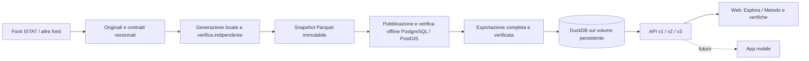

# Itadb

**Una popolazione sintetica italiana, interrogabile ed esplorabile, con evidenze e
assunzioni verificabili.**

Itadb integra statistiche territoriali per costruire individui e famiglie virtuali.
Ogni snapshot conserva input, algoritmo, seed e verifiche. Gli individui non
corrispondono a persone reali; le relazioni generate sono proprietà del modello.

## Il prodotto

La popolazione verificata viene servita **integralmente da DuckDB in sola lettura**
tramite API. Neon e PostgreSQL non sono richiesti online. La web app ha due parti:

- **Esplora:** mappa scura a schermo intero con modalità Regioni, Province e
  Comuni. Ogni modalità adatta confini, aggregati, ricerca e selezione territoriale.
  Offre filtri individuali, istogrammi, elenco paginato degli individui e navigazione
  delle famiglie e dei loro componenti.
- **Metodo e verifiche:** fonti con collegamenti agli originali, sequenza delle
  integrazioni, assunzioni, verifiche sui record del database e confronto tra
  conteggi di origine e conteggi sintetici, anche per singolo comune.

Il riferimento corrente contiene **58.943.464 individui e 26.670.169 famiglie**,
con riferimento demografico 1° gennaio 2025, in 7.896 comuni. Ordine del modello:
**sesso/età → geografia → cittadinanza → famiglie**. I conteggi osservati ammessi
sono conservati; l'incrocio età–singola cittadinanza e la composizione familiare
restano sintetici. La classe familiare 6+ usa 6 componenti; 560.159 adulti
restano senza assegnazione familiare. [Metodo e input](docs/population.md).

La localizzazione corrente è comunale. La mappa mostra punti rappresentativi
dei territori, **non residenze individuali**. Province e regioni sommano individui
e famiglie dei comuni, anche senza coordinate; i loro marcatori sono ancorati
al punto comunale più vicino al baricentro dei punti disponibili, pesato per
individui. I cerchi e le schede riportano totali territoriali; i filtri individuali
agiscono su istogramma ed elenco. Coordinate di residenza e densità
locale saranno una successiva integrazione del modello e un nuovo snapshot.

## Architettura



La generazione è un workflow CLI documentato nel repository. L'applicazione
serve solo snapshot pubblicati e non avvia generazioni durante le richieste.
API e frontend non hanno bisogno dell'archivio locale degli originali.
DuckDB conserva tutti i dati pubblici, comprese geografia e verifiche. PostgreSQL
resta nel workflow locale di preparazione; Parquet conserva la riproduzione del run.

| Componente | Tecnologia |
|---|---|
| Archivio online | DuckDB immutabile, tipizzato, con tutte le release e geometrie GeoJSON |
| Preparazione offline | PostgreSQL 17 + PostGIS 3.5, generazione e audit separati |
| Backend | Python 3.13, FastAPI, Pydantic, lettori DuckDB limitati, OpenAPI |
| Workflow | Python, DuckDB, Parquet/Zstandard, CLI Typer |
| Frontend | React, TypeScript, Vite; mappa vettoriale SVG/Canvas |
| Verifiche | pytest, Ruff, mypy, Vitest, test PostgreSQL reali |

La destinazione è un frontend statico e FastAPI su Railway con volume persistente,
senza Neon. Il repository include la configurazione; il deployment cloud non è
ancora eseguito. [Procedura completa](docs/deployment.md),
[decisione architetturale](docs/adr/0017-duckdb-serving.md).

Il [confronto PostgreSQL/DuckDB/Rust](docs/benchmarks/storage-comparison-2026-09-25.md)
conserva le misure dell'esperimento che ha motivato la migrazione.
Il [report della migrazione completa](docs/benchmarks/duckdb-migration-2026-09-25.md)
documenta archivio, parità API e prove senza PostgreSQL.

## Avvio locale

Ambiente supportato: Linux, con Ubuntu/WSL2 come riferimento. Vedi la
[guida locale](docs/local-environment.md).

Solo per la preparazione PostgreSQL locale: i database precedenti al
consolidamento richiedono il [passaggio alla baseline](docs/operations.md#baseline-consolidata).

Avvio con Docker Compose:

```sh
cp -n .env.example .env
uv sync --locked
uv run itadb init-serving  # solo prima installazione, catalogo vuoto esplicito
docker compose up --build -d --wait
```

- Web app: <http://localhost:8080>
- Snapshot disponibili: <http://localhost:8080/api/v3/populations>
- Swagger: <http://localhost:8080/api/docs>
- Contratto: [OpenAPI versionata](docs/api/openapi.json)

Per usare i dati esistenti, esportare e installare l’archivio seguendo la
[guida deployment](docs/deployment.md), senza eseguire `init-serving`.
L'inizializzazione esplicita mostra un catalogo vuoto. L'applicazione non
sostituisce dati assenti o errori con una popolazione dimostrativa.

Per sviluppo senza container applicativi:

```sh
uv sync --locked
uv run itadb serve
# In un secondo terminale:
npm --prefix apps/web ci
npm --prefix apps/web run dev
```

## Generazione e pubblicazione

La [procedura completa](docs/population.md) acquisisce gli input, esegue
`synthesize-population` e verifica con `verify-population`. Per uno snapshot
completato, usando il percorso del run effettivo:

```sh
uv run python scripts/run_logged.py --label "Pubblicazione popolazione" --log .tools/population-publication.log -- uv run itadb publish-population --run data/curated/population/RUN_ID
```

L'importatore ripete l'audit, verifica provenienza e geografia, carica famiglie
e individui con COPY, confronta le distribuzioni PostgreSQL con i vincoli e
pubblica atomicamente. Errori producono rollback e rapporto di quarantena.
Un retry identico riusa lo snapshot pubblicato. Le evidenze precedenti non
vengono sovrascritte. [Operazioni e misure](docs/operations.md).

Questo passaggio prepara il database **locale**. Per aggiornare il prodotto,
eseguire poi `export-serving`, `install-serving --activate` e riavviare l’API,
come descritto nella [procedura](docs/deployment.md).

## Verifiche di sviluppo

```sh
uv run ruff check .
uv run ruff format --check .
uv run mypy
uv run python scripts/check_docs.py
uv run pytest -m "not integration"
uv run itadb export-openapi
npm --prefix apps/web run api:types
npm --prefix apps/web run typecheck
npm --prefix apps/web run format:check
npm --prefix apps/web test
npm --prefix apps/web run build
```

I test di integrazione richiedono un server PostgreSQL/PostGIS **dedicato ai
test**, migrato e con ruolo reader. Impostare `ITADB_TEST_DATABASE_URL` e
`ITADB_TEST_READER_URL` dello stesso database, quindi `uv run pytest -m integration`.
Alcuni test creano database `itadb_publication_test_*`: il ruolo deve poterli creare.
Non usare il server applicativo. [Procedura](docs/local-environment.md#postgresql-dedicato-ai-test).

## Struttura del repository

```text
src/itadb/connectors/    acquisizione limitata delle fonti
src/itadb/synthesis/     generazione e audit riproducibili
src/itadb/population/    pubblicazione offline degli snapshot in PostgreSQL
src/itadb/serving/       esportazione, integrità e lettori dell’archivio DuckDB
src/itadb/api/           API della popolazione e delle evidenze
apps/web/               mappa, esplorazione, metodo e verifiche
contracts/              contratti versionati e indice per funzione
scripts/                manutenzione e benchmark
data/                   archivio locale, escluso da Git salvo la guida
docs/                   guide correnti per argomento
migrations/             baseline PostgreSQL/PostGIS e successive revisioni immutabili
src/itadb/pipeline/      acquisizione e pubblicazione degli aggregati
```

Il prodotto usa `population-reference/1` e le API v3. Le API v1/v2 servono
gli aggregati statistici. L’[indice della documentazione](docs/README.md)
raccoglie metodo, procedure e obiettivi del prodotto.
Per orientarsi: [contratti](contracts/README.md), [dati locali](data/README.md),
[strumenti](scripts/README.md).

- [Architettura](docs/architecture.md), [modello dati](docs/data-model.md), [API](docs/api/README.md)
- [Popolazione e workflow](docs/population.md), [priorità di fedeltà](docs/model-fidelity.md)
- [Roadmap](docs/roadmap.md), [verifiche](docs/validation.md), [decisioni](docs/adr/README.md)
- [Contribuire](CONTRIBUTING.md), [governance](GOVERNANCE.md), [sicurezza](SECURITY.md)

Codice Apache-2.0; fixture inventate CC0-1.0. Le fonti mantengono la propria
licenza, registrata nella provenienza di ogni snapshot. Nessun dump o record
individuale viene inserito nel repository Git.
