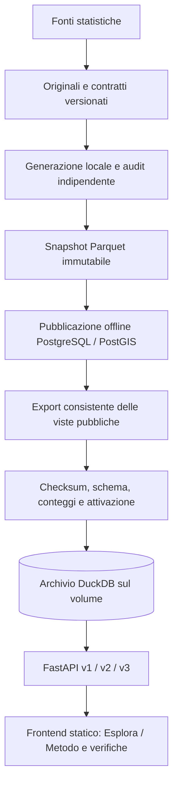

# Architettura

## Prodotto e workflow

Il prodotto rende interrogabile la popolazione sintetica italiana. Un monolite
Python contiene generazione, pubblicazione e API in moduli separati, eseguiti in
processi diversi. Il servizio online è FastAPI con DuckDB incorporato su volume
persistente e frontend statico. Nessun database remoto è necessario.
[ADR 0017](adr/0017-duckdb-serving.md).

L'archivio contiene tutti gli snapshot pubblicati, tutte le release v1/v2,
provenienza, validazioni e geometrie. Non modifica il modello sintetico e non
presenta gli individui come persone reali. Gli originali della generazione non
sono richiesti dal server API.

## Preparazione offline

Parquet/Zstandard conserva i risultati riproducibili. Il workflow locale esistente
usa PostgreSQL 17/PostGIS 3.5 per importazione, vincoli, verifiche e cartografia.
I record pubblicati sono immutabili; nuove revisioni non sovrascrivono le precedenti.
Gli ID int64 delle persone e famiglie restano locali allo snapshot.

L'importazione verifica per insiemi relazioni, coorti, margini e provenienza. Gli
errori producono rollback e quarantena. Le migrazioni SQL applicate rimangono
immutabili; questa migrazione non altera quelle revisioni.
[Schema offline e archivio pubblico](data-model.md).

`export-serving` legge esclusivamente le viste `api.*` con ruolo reader in una
transazione PostgreSQL REPEATABLE READ READ ONLY. I timeout brevi del reader sono
sospesi soltanto nella sessione di esportazione, per consentire la scansione
nazionale. Le geometrie vengono convertite offline in GeoJSON con gli stessi
parametri usati dalle API PostgreSQL. L'esportazione conserva date, decimali,
null, booleani e metadati JSON, senza inferenza dei tipi numerici.

## Archivio online

Ogni release distribuibile contiene `application.duckdb` e `manifest.json`.
Il manifest versiona il formato, registra conteggi e controlli del trasferimento,
SHA-256 e dimensione del database. Lo schema pubblico è definito in
`src/itadb/serving/schema.py`. Le tabelle colonnari usano ordinamenti territoriali
per facilitare le selezioni; non vengono costruiti indici ART nazionali in RAM. La tabella `text_order`
conserva ranghi calcolati dalla collation PostgreSQL, per mantenere lo stesso
ordinamento di nomi, codici, etichette e metadati anche su sistemi diversi.

Installazione e attivazione sono distinte: una copia verificata entra in una
nuova directory `releases/SHA256`; soltanto dopo può diventare `current` tramite
sostituzione atomica del collegamento. Installazioni ripetute riusano la stessa
release verificata. Errori lasciano intatta quella attiva e conservano evidenze.
Le copie precedenti permettono il rollback; il backup esterno resta necessario.

Il processo API verifica l'archivio e fissa una release all'avvio. Non segue
`current` tra una query e la successiva. Il cambio versione richiede riavvio;
non esistono scritture DuckDB durante le richieste. Un archivio assente o non
valido produce readiness 503; la liveness resta disponibile. Un catalogo vuoto
è possibile soltanto attraverso l'inizializzazione esplicita.

## API e risorse

FastAPI/Pydantic conserva le route e gli schemi v1/v2/v3. Le query usano valori
parametrizzati, identificatori scelti da allowlist, limiti e filtri obbligatori.
Le pagine di individui/famiglie richiedono snapshot e comune, massimo 500 righe.
L'ancora di paginazione viene letta una volta dalla stessa release immutabile;
a parità di ordinamento l'ID crescente evita salti o duplicati. I null nelle
tabelle v2 restano in fondo in entrambe le direzioni. Decimal resta una stringa JSON.

Un worker Uvicorn con connessione DuckDB condivisa e cursori per le query gestisce
più richieste simultanee. I default sono 4 query concorrenti, 2 thread DuckDB,
256 MB di memoria del motore e timeout di 5 secondi per attesa ed esecuzione.
Il limite del motore non include tutta la RAM Python o le risposte HTTP. Il numero
di worker moltiplica i budget: l'immagine ne avvia uno. L'accesso esterno e il
caricamento automatico di estensioni DuckDB sono disabilitati.

`ITADB_SERVING_BACKEND=duckdb` è il default. L'adattatore `postgres` è esplicito
e serve al confronto e ai test del workflow locale; non è un fallback automatico.
CORS e request ID restano invariati. Gli errori pubblici non riportano query,
valori ricevuti, percorsi locali o credenziali.

## Frontend e deployment

La web app React/Vite è statica e usa `VITE_API_BASE_URL`. La mappa offre Regioni,
Province e Comuni con confini, marker territoriali e totali. Istogrammi ed elenchi
sono filtrabili; Metodo conserva fonti e verifiche. Nessuna coordinata individuale
è stata aggiunta. I componenti storici degli aggregati restano in
`apps/web/src/evidence/`; le API v1/v2 continuano a funzionare.

Compose avvia API e web con archivio montato in sola lettura. Il profilo `offline`
contiene PostgreSQL/PostGIS, migrazioni e pipeline. La configurazione Railway
prevede un servizio API con volume, senza Neon; frontend statico separato.
[Avvio, backup e aggiornamenti](deployment.md). La configurazione nel repository
non dimostra un deployment cloud già effettuato.
