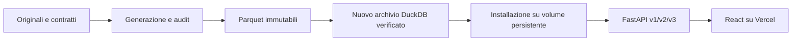

# Architettura

Itadb usa **un solo database: DuckDB**. Python gestisce acquisizione, generazione,
audit, pubblicazione e API; il frontend React/Vite è statico.

## Preparazione

La generazione conserva input, algoritmo, seed, checkpoint e rapporti.
La pubblicazione legge direttamente i Parquet e ricalcola distribuzioni e
relazioni in DuckDB. I moduli `pipeline/` pubblicano gli aggregati; `population/`
pubblica individui e famiglie. Tutti usano lo stesso meccanismo in
`serving/publication.py`.

Un file lock serializza le pubblicazioni sul computer di preparazione. Ogni
tentativo lavora su una nuova copia dell'ultimo archivio completo, preservando
le release già pubblicate. In assenza di un archivio di preparazione si usa
quello del servizio, se disponibile; altrimenti si crea uno schema vuoto.
Un archivio esistente ma corrotto impedisce la pubblicazione.

Audit, provenienza, relazioni, conteggi e cartografia devono passare prima di
chiudere il file, verificarlo e attivarlo in `data/published`. Un errore conserva
il tentativo e la quarantena senza cambiare la versione pubblicata. L'installazione
nel servizio è un passo separato: la preparazione non aggiorna l'app automaticamente.

## Decisione cartografica

L'estensione ufficiale `spatial` di DuckDB esegue trasformazione del sistema di
coordinate, riparazioni ammesse, semplificazione e verifiche geometriche nella
preparazione. Riutilizza il motore esistente e non introduce altri servizi o
librerie Python geografiche. Si installa esplicitamente con `itadb prepare-spatial`;
le pubblicazioni successive la caricano localmente. Versione del motore e checksum
sono conservati nel manifest. L'applicazione riceve soltanto GeoJSON.

Per la popolazione, la semplificazione e l'arrotondamento devono mantenere geometrie
valide e una differenza simmetrica inferiore all'1% dell'area del confine originale.
Quando superano questa soglia, si conserva il contorno originale, arrotondato solo
se il controllo passa. Il controllo misura la fedeltà visiva in coordinate
geografiche; non stima superfici catastali.

## Archivio e API

Il pacchetto distribuibile contiene `application.duckdb` e `manifest.json`.
Il manifest lega formato, schema, conteggi e SHA-256 al file. L'installazione crea
`releases/SHA256`; l'attivazione aggiorna atomicamente il collegamento `current`.
Le copie precedenti permettono il rollback. Il backup va conservato anche altrove.

Ogni processo API verifica e fissa una release all'avvio. Le query non scrivono
nel file e non cambiano archivio durante una risposta. Una nuova attivazione
richiede riavvio. Archivio assente o corrotto: readiness e richieste dati 503;
liveness disponibile. Il catalogo vuoto richiede inizializzazione esplicita.

Query parametrizzate, identificatori da allowlist, filtri obbligatori, pagine
limitate e cursori stabili costituiscono il contratto pubblico. Decimal resta
una stringa JSON; null, zero e dati soppressi rimangono distinti. I ranghi testuali
sono memorizzati nell'archivio; le nuove pubblicazioni usano l'ordine DuckDB,
indipendente dalla locale del sistema. I cursori valgono per la release selezionata.

Un worker Uvicorn gestisce più richieste con lettori limitati: default 4 query,
2 thread DuckDB, 256 MB per il motore e timeout di 5 secondi. Il limite DuckDB
non comprende tutta la RAM Python. Caricamento di estensioni e accesso esterno
sono disabilitati nel servizio. Gli errori pubblici non espongono percorsi o SQL.

## Deployment

Vercel ospita `apps/web/dist`; Railway esegue l'immagine API e monta il volume.
Compose offre gli stessi due componenti in locale. Il frontend configura
`VITE_API_BASE_URL`; il backend ammette l'origine tramite CORS.
[Procedura completa](deployment.md), [verifiche](validation.md).
