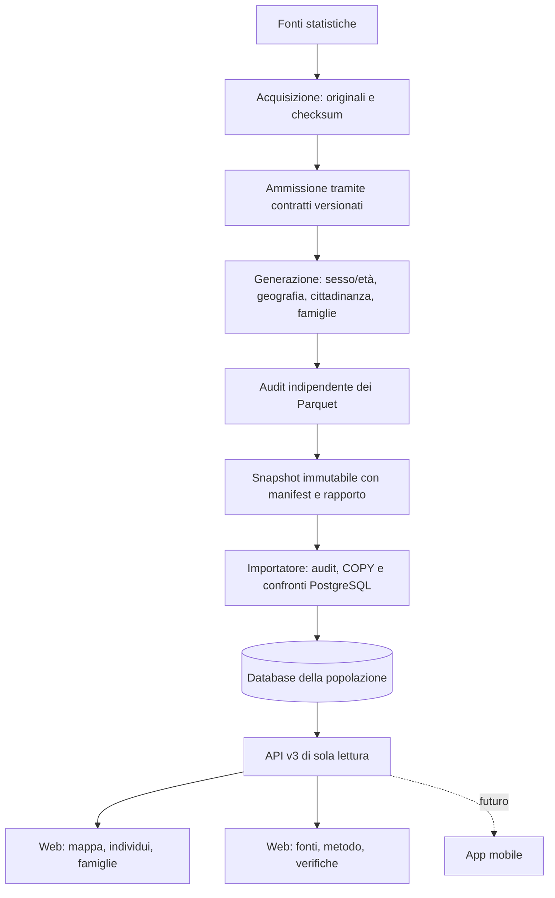

# Architettura

## Prodotto e workflow

Il prodotto rende interrogabile la popolazione sintetica italiana. Un monolite
Python contiene generazione, pubblicazione e API come moduli separati; sono
eseguiti in processi diversi. La generazione è un workflow CLI consultabile su
GitHub. Database, API e frontend costituiscono l'applicazione da distribuire.
[ADR 0015](adr/0015-population-product.md).

Le API v1/v2 servono gli aggregati statistici e le loro evidenze.
L’importatore della popolazione usa la geografia e i contratti dello stesso
snapshot 2025, indipendentemente dagli aggregati di altri anni.

## Archivio e database

Parquet/Zstandard conserva i risultati riproducibili. PostgreSQL 17/PostGIS 3.5
conserva **tutti** gli individui e le famiglie pubblicati. Gli identificativi
int64 sono locali allo snapshot; ogni chiave include `snapshot_id`. Gli
attributi individuali sono colonne tipizzate, non documenti JSON.

Persone, famiglie, celle statistiche e confronti sono partizionati per
snapshot. Il catalogo usa un ID bigint compatto e conserva run ID SHA-256 e
checksum del manifest per collegarlo all'archivio. Gli indici servono lettura
per ID, selezione comunale e componenti di una famiglia. Eventuali indici
aggiuntivi devono essere giustificati da piani e misure delle query reali.

L'importazione è una transazione: COPY a blocchi territoriali, verifica delle
relazioni e delle coorti, distribuzioni calcolate dai record PostgreSQL e
confronto con gli input ammessi. Non si carica la popolazione nazionale in
liste Python. Gli errori lasciano rapporti di quarantena, nessuno snapshot
parzialmente visibile. Un lock transazionale serializza i retry del run.

I record pubblicati sono protetti da trigger per istruzione sulle partizioni,
per evitare un controllo per ciascuno dei milioni di individui importati.
Il controllo delle relazioni è per insiemi durante la pubblicazione; non è
un insieme di foreign key eseguite riga per riga durante COPY. Il ruolo reader
vede esclusivamente le viste `api.*`; l'importatore usa il ruolo amministrativo
locale. L'immutabilità applicativa non protegge da un amministratore che
rimuova i trigger. [Schema e garanzie](data-model.md).

## API e frontend

FastAPI/Pydantic espone un contratto OpenAPI da cui sono generati i tipi
TypeScript. Le API non leggono file della generazione e non eseguono calcoli
di sintesi. Le query usano parametri, filtri e limiti; le liste di individui e
famiglie richiedono snapshot e comune, usano cursori e al massimo 500 righe.
I confronti e gli istogrammi nazionali leggono distribuzioni derivate dai
record importati, senza riscansionare 59 milioni di righe a ogni richiesta.

Il pool è configurabile tramite `ITADB_POOL_MIN_SIZE` e `ITADB_POOL_MAX_SIZE`,
con default 1–8 connessioni per processo. Timeout connessione e SQL: 5 secondi.
Il budget totale va dimensionato come repliche × processi × pool massimo.
La readiness verifica anche le viste della popolazione. Errori e access log
non riportano credenziali, query string o valori ricevuti.

La web app React/Vite è statica. La mappa usa SVG per i confini regionali e
Canvas per i punti comunali, con zoom, trascinamento, controlli da tastiera e
ricerca territoriale alternativa. Istogrammi ed elenchi sono moduli sovrapposti.
La sezione Metodo collega fonti, modello e verifiche allo snapshot selezionato.

I componenti dell’esploratore degli aggregati e i relativi test sono
raccolti in `apps/web/src/evidence/`. Non sono montati dalla web app corrente;
le API v1/v2 rimangono disponibili per l'archivio degli aggregati.

Il riferimento corrente assegna comuni ma non coordinate individuali. I
punti comunali sono rappresentativi dei territori e dichiarati aggregati.
La futura residenza latitudine/longitudine richiederà una nuova integrazione,
un nuovo snapshot, indici spaziali e query per area visibile. La mappa dovrà
modulare punti e aggregazioni al variare dello zoom, senza trasferire tutta
la popolazione nazionale al browser a ogni richiesta.

## Destinazione gestita

La destinazione richiesta è nell'ecosistema Vercel, Neon, Railway e Cloudflare.
Non è stato configurato un deployment. Il frontend usa `VITE_API_BASE_URL`;
l'API usa `ITADB_DATABASE_URL`, CORS esplicito e un pool limitato. Il workflow
locale non è necessario sui server dell'applicazione. I requisiti PostGIS,
spazio reale, budget connessioni e query misurate guideranno la scelta dei
servizi; nominarli non implica compatibilità o capacità già verificate.

Compose resta uno strumento di sviluppo locale. Nessun microservizio,
scheduler, sistema email o dipendenza cartografica è stato aggiunto.
Le misure nazionali e i limiti effettivi sono in [validation.md](validation.md).
