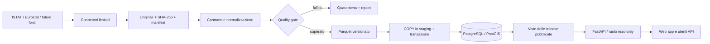

# Architettura

## Decisione

Separare il database che risponde alle API dall'archivio che alimenta elaborazioni e
riproducibilità. PostgreSQL 17/PostGIS 3.5 serve metadati e aggregati indicizzati;
Parquet/Zstandard conserva risultati analitici; DuckDB esegue trasformazioni locali
colonnari. Il codice di acquisizione e pubblicazione è Python 3.13 con dipendenze uv
bloccate. React/TypeScript consuma il contratto FastAPI/OpenAPI, senza accesso diretto al DB.

Nella v0.1 il percorso completo parte dalla fixture demo; i connettori reali arrivano
all'archivio originale. La trasformazione di SDMX reali necessita onboarding specifico.
Le viste e le API escludono dati non pubblicati. L'archivio locale implementato usa path
relativi e contenuti indirizzati per checksum; S3 è una destinazione futura, non presente.

## Confini e scalabilità

- Monolite modulare, processi distinti per API e batch. Nessun lavoro lungo nel ciclo HTTP.
- La PK delle osservazioni `(release_id, series_id, period, territory_id)` corrisponde alle
  query servite. Release, serie e periodo sono filtri fissi; paginazione keyset, massimo
  500 righe. Nessun OFFSET crescente, SELECT nazionale illimitato o conteggio totale per pagina.
- Otto partizioni hash per release limitano l'overhead di pianificazione e consentono pruning.
  È una baseline da misurare, non un numero universalmente ottimale. Una release grande non
  viene suddivisa tra queste partizioni; è un limite deliberato della fase aggregata.
- Pool di 8 connessioni per processo, timeout SQL 5 s e connessioni 5 s. Aumentando i worker
  il budget è `repliche × processi × pool_max_size`; riservare capacità a import e manutenzione.
  PgBouncer e repliche di lettura si introducono dopo misure di concorrenza e consistenza.
- COPY verso staging e insert set-based; lettura Parquet in batch da 10.000 righe. Niente
  INSERT per ogni osservazione. I trigger di immutabilità costano: non copiare questa strategia
  riga per riga nel futuro caricamento di decine di milioni di agenti.
- Le geometrie sono separate dalle osservazioni; GiST per filtri spaziali. Servire confini
  semplificati o vector tiles in una fase dedicata, non un GeoJSON nazionale a ogni apertura.
- DuckDB limita memoria e thread nella normalizzazione; Parquet abilita lettura selettiva
  di colonne e gruppi di righe. Preferire file da circa 128–512 MiB come ipotesi di prova,
  senza una partizione per persona/comune o una miriade di file piccoli.

## Popolazione sintetica 1:1: progetto della fase successiva

L'individuo statistico non è un agente LLM e non richiede un processo per persona.
La generazione dovrà essere vettorizzata, per blocchi territoriali, riproducibile con seed
e versioni di input/algoritmo. Vietata la ricostruzione o associazione a identità reali.

Entità previste:

| Entità | Chiave e rappresentazione | Vincoli da dimostrare |
|---|---|---|
| Run di sintesi | UUID; release input, seed, algoritmo, parametri, commit | Nessun input implicito o mutable |
| Snapshot | run + data simulata + versione schema | Immutabile; confronto tra scenari esplicito |
| Famiglia | snapshot + bigint household_id; territorio bigint | Cardinalità, tipologia e disponibilità abitazione |
| Persona | snapshot + bigint person_id; household_id; attributi tipizzati | Integrità familiare, domini, vincoli di età |
| Abitazione | snapshot + bigint dwelling_id; territorio; tipologia | Nessun indirizzo reale identificante necessario |
| Lavoro/servizi | tabelle collegate, cataloghi tipizzati | Coerenza territoriale e margini osservati |
| Evento | scenario + intervallo + id; append-only | Nessun clone completo dello stato a ogni passo |

Snapshot completi in Parquet, partizionati inizialmente per snapshot e macroarea/regione;
ordinamento locale per territorio/famiglia. Identificativi int64 densi nel run; categorie
in interi piccoli/dizionari. Separare attributi rari e relazioni; evitare JSON per individuo,
UUID multipli per ogni relazione e wide table con centinaia di colonne vuote.
PostgreSQL serve catalogo, risultati aggregati e sottoinsiemi interattivi; un'eventuale
proiezione nazionale di agenti nel DB richiede un ADR e benchmark di query reali.

Ordine di grandezza **illustrativo**, non misura: 60 milioni di righe × 64 byte di attributi
utili = 3,84 GB decimali prima di intestazioni, indici, relazioni, geometrie, versioni e WAL.
Dieci snapshot moltiplicano lo spazio del nucleo per dieci. Questo non è un preventivo RAM
o disco: compressione, correlazioni e query cambiano il risultato. Misurare RSS, spazio,
latenza e throughput a 1M, 10M e scala nazionale prima di scegliere capacità produttiva.

`scripts/benchmark.py` è solo una prova colonnare ripetibile a bassa entropia. Non misura
la sintesi, PostgreSQL, la concorrenza web o la correttezza statistica. Non estrapolarne i
tempi linearmente a una popolazione vera. Per prove complete registrare hardware, versioni,
distribuzione dei dati, p50/p95/p99, picco RAM, WAL e piani EXPLAIN (ANALYZE, BUFFERS).

## Operazioni future e criteri di adozione

S3 compatibile quando archivio e worker si distribuiscono; catalogo Iceberg solo se servono
transazioni del lake, evoluzione schema e lettori multipli. Orchestratore (es. Dagster)
quando dipendenze, backfill e pianificazioni superano il CLI. ClickHouse o motore equivalente
solo se aggregazioni concorrenti eccedono PostgreSQL e vengono quantificate. Niente deploy
Kubernetes prima di un requisito operativo reale.

## Riferimenti verificati il 23 settembre 2026

- [PostgreSQL: partizionamento](https://www.postgresql.org/docs/17/ddl-partitioning.html)
- [PostGIS: indici spaziali](https://postgis.net/documentation/faq/spatial-indexes/)
- [DuckDB: Parquet e pushdown](https://duckdb.org/docs/current/data/parquet/overview)
