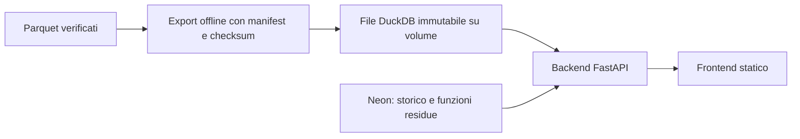

# PostgreSQL, DuckDB e archivio Rust: costo ed efficienza

25 settembre 2026 — branch `experiment/population-storage-costs`.
Esperimento concluso sullo snapshot nazionale completo. Nessuna migrazione
dell'applicazione o pubblicazione cloud eseguita.

**Per il prossimo deployment sceglierei DuckDB come archivio della popolazione.**
È il miglior compromesso misurato fra spazio, RAM, prestazioni e lavoro di
manutenzione. Rust vince nettamente sulle operazioni per cui dispone di accessi
diretti, ma non su tutti gli ordinamenti e non automaticamente sulla bolletta.
PostgreSQL può essere molto migliorato: il problema attuale non è soltanto il
motore, ma anche lo schema e i piani delle query.

La raccomandazione riguarda il motore della consultazione nazionale. Le API
storiche, le validazioni e la geografia restano da integrare nella migrazione:
**questo esperimento non consente ancora di eliminare Neon dal prodotto**.

## Dati, metodo e verifiche

Run `24a56e3bdb58fb1af523ea1b6019e8de04292ecdf11105fc6885cacc4903b76c`:
58.943.464 individui sintetici, 26.670.169 famiglie, 7.896 comuni e 3.943.689
celle aggregate. Riferimento demografico: 1° gennaio 2025. Non sono persone reali.
Manifest SHA256: `f0125af1adb2926bc4e399d90c057ee080d5c8919e1ea74339f3be1d3842fc8d`.

L'audit indipendente `verify-population` è passato in 37,9 secondi. I checksum
dei 214 Parquet finali coincidono con il manifest. Sono conservati gli ID,
le famiglie, i 560.159 adulti senza famiglia, il sesso, la cittadinanza, l'adulto
di riferimento e le coorti di nascita, compresa la classe aperta 100+.
Non si ricostruiscono persone virtuali a ogni richiesta.

I quattro adapter sono stati confrontati con 25 casi, sette ripetizioni per
caso e hash delle risposte canoniche. Altri **352 casi** verificano ordinamenti
ascendenti/discendenti, tie-break, cursori, filtri, record casuali e componenti
familiari. Tutti concordano. Il controllo integrale dei flussi canonici di
individui, famiglie e celle restituisce gli stessi SHA256 per PostgreSQL
attuale, PostgreSQL compatto e Rust rispetto all'export DuckDB dai Parquet.
Si confrontano tutti i record, non soltanto un campione o il totale delle righe.

I campi costanti o derivabili dell'API, come `data_kind`, padding dei codici e
`age_is_lower_bound`, sono normalizzati nella rappresentazione di confronto.
Questo verifica i dati e le operazioni del nucleo di consultazione, non la
compatibilità HTTP/OpenAPI dell'intera applicazione.

Ambiente: Ubuntu/WSL2, AMD Ryzen 9 9900X, 24 thread logici, circa 30 GiB RAM;
Python 3.13.15, PostgreSQL 17.5/PostGIS 3.5, DuckDB 1.5.5, Rust 1.98.1.
Il server PostgreSQL è stato limitato a **2 CPU e 4 GiB**, con il client Python
misurato separatamente. I motori incorporati hanno un cgroup da **2 CPU e
4 GiB**, senza swap. PostgreSQL dispone quindi anche del piccolo client esterno:
non sono topologie con un identico tetto aggregato. Il consumo CPU riportato
somma client e server PostgreSQL.

Le misure includono adapter, conversione Python e serializzazione JSON; escludono
FastAPI, TLS, browser e latenza cloud. Sono eseguite in sequenza, senza altri
benchmark pesanti contemporanei. Non rappresentano un confronto Neon/Railway
1:1, né una previsione del numero di utenti del sito.

## Dove finiscono i 17 GB e i «200 byte»

Il database applicativo misura **17.225.763.987 byte**; lo schema `population`
17.119.485.952 byte. La misura diretta chiarisce quanto pesa ogni componente:

| Componente attuale | Tabelle e strutture accessorie | Indici | Totale, GB decimali |
|---|---:|---:|---:|
| Individui | 4,540 GB | 8,022 GB | 12,562 |
| Famiglie | 1,418 GB | 2,243 GB | 3,661 |
| Celle aggregate | 0,238 GB | 0,208 GB | 0,446 |
| Validazioni | 0,273 GB | 0,171 GB | 0,444 |

Per individuo sono **circa 77 byte di tabella e 136 byte di indici: 213 byte**.
Per famiglia il totale è circa 137 byte. Dividere tutto lo schema della
popolazione per individui più famiglie restituisce circa 200 byte: è una media
che include anche indici, aggregati e validazioni, non la lunghezza di un record.
I circa 35 byte dei soli valori individuali escludono metadati delle tuple,
allineamenti, pagine e indici. In questo database gli indici degli individui
pesano più dei dati della tabella: la differenza è misurata, non un overhead
generico assunto a priori.

## Spazio delle alternative

Il perimetro comune è individui + famiglie + celle aggregate. PostgreSQL
compatto elimina la ripetizione dello snapshot e usa ID a 32 bit, coorti
reversibili e indici più piccoli; aggiunge anche l'indice comune/età/id.
DuckDB conserva tabelle native ordinate, compresse e senza grandi indici ART.
L'ordinamento favorisce le zone map; gli ART hanno costi di memoria e non
accelerano genericamente ordinamenti e aggregazioni.
[Documentazione DuckDB](https://duckdb.org/docs/current/guides/performance/indexing).

| Motore | Nucleo di consultazione | Riduzione dal nucleo attuale | Totale stimato con PostgreSQL residuo |
|---|---:|---:|---:|
| PostgreSQL attuale | 16,669 GB | — | 17,226 GB |
| PostgreSQL compatto | 11,510 GB | 31,0% | 12,066 GB |
| DuckDB | **0,224 GB** | **98,7%** | **0,780 GB** |
| Rust | **1,545 GB** | **90,7%** | **2,102 GB** |

Il residuo di **556,6 MB** comprende ciò che non viene sostituito: validazioni,
geografia, cataloghi e storico. È una sottrazione delle dimensioni attuali,
non la misura di un database residuo già migrato. Non lo si può considerare
automaticamente compatibile con il limite gratuito di Neon da 0,5 GB.

Rust usa 12 byte per individuo e 12 per famiglia, più componenti, permutazione
per età, celle e manifest. Il dettaglio è nel [formato del prototipo](../../experiments/population-store/README.md).
DuckDB comprime molto di più perché questi dati sono ordinati e hanno numerose
ripetizioni; gli ID consecutivi sono particolarmente comprimibili. Il risultato
non si estende automaticamente a dati futuri meno regolari.

I Parquet finali di individui e famiglie occupano 254,4 MB. Il DuckDB comprende
anche aggregati e dizionario geografico, pur risultando leggermente più piccolo.
Gli archivi del test contengono un solo snapshot. Vecchie release, backup e file
intermedi vanno conteggiati separatamente.

## Latenza delle operazioni

Mediane in millisecondi. Le pagine contengono 100 record; il comune grande è
Roma, con 2.747.290 individui sintetici. Non c'è cache delle risposte.

| Operazione | PG attuale | PG compatto | DuckDB | Rust |
|---|---:|---:|---:|---:|
| Individuo per ID nel comune grande | 0,515 | 0,535 | 1,249 | 0,006 |
| Prima pagina per ID | 0,775 | 0,609 | 1,683 | 0,063 |
| Prima pagina per età decrescente | 2.703,200 | 0,575 | 2,623 | 0,064 |
| Seconda pagina per età | 7.195,513 | 0,876 | 4,746 | 0,089 |
| Filtro sesso/cittadinanza/età | 21,954 | 13,945 | 1,845 | 0,394 |
| Famiglia e componenti | 0,923 | 0,828 | 9,201 | 0,008 |
| Ordinamento per sesso | 1.791,520 | 764,998 | 8,445 | 19,872 |
| Ordinamento per cittadinanza | 2.058,250 | 759,869 | 10,272 | 19,498 |
| Ordinamento per famiglia | 1.998,657 | 757,910 | 10,865 | 20,357 |
| Famiglie per dimensione | 402,578 | 69,576 | 1,008 | 5,311 |
| Distribuzione nazionale | 356,705 | 195,121 | 10,101 | 2,995 |
| Distribuzione comunale | 8,898 | 2,744 | 0,883 | 0,084 |

I piani `EXPLAIN (ANALYZE, BUFFERS)` spiegano la differenza PostgreSQL: la
baseline legge e ordina milioni di righe; il compatto legge 100 righe tramite
`person_municipality_age`. Questo indice specifico, insieme alla coorte
materializzata, elimina il collo di bottiglia dell'età. Non dimostra che
PostgreSQL sia intrinsecamente lento, né che basti cambiare un parametro.

L'adattamento SQL conta anche per DuckDB: la paginazione ereditata generava un
join correlato superfluo, anche sulla prima pagina. Risolvere prima l'ancora
filtrata e poi la pagina porta la prima pagina per ID da 130,8 a 1,7 ms.
Le due letture sono coerenti perché gli archivi sono immutabili. Gli stessi
criteri per cursori assenti, filtri e tie-break sono verificati sui quattro motori.

Nel prototipo Rust gli ordinamenti senza indice usano selezione dei primi K e
ordinamento della sola pagina, ma scandiscono il comune. **DuckDB li gestisce
meglio** in questo test. Aggiungere altri indici Rust avrebbe costi di spazio,
RAM, build e manutenzione; non è necessario per dimostrare il compromesso.

## Concorrenza e consumo computazionale

Ogni prova dura almeno 10 secondi e completa l'ultimo blocco di richieste.
Non si estrapolano migliaia di richieste al secondo da pochi millisecondi di
burst. Il mix principale contiene, in parti uguali: individuo per ID, pagina
per ID, pagina per età, famiglia, filtro cittadinanza, distribuzione comunale
e nazionale. Il mix esteso aggiunge i tre ordinamenti per sesso, cittadinanza
e famiglia. Sono carichi dichiarati, non traffico reale osservato sul prodotto.

Risultati con **8 client concorrenti**:

| Motore | Mix principale, req/s | p95 | CPU per richiesta | Mix esteso, req/s | p95 esteso |
|---|---:|---:|---:|---:|---:|
| PG attuale | 3,0 | 15.699 ms | 666,8 ms | 1,2 | 18.980 ms |
| PG compatto | 30,4 | 1.507 ms | 66,7 ms | 3,3 | 7.609 ms |
| DuckDB | **205,0** | **94,3 ms** | **9,73 ms** | **151,6** | **103,4 ms** |
| Rust | **3.140,5** | **4,0 ms** | **0,64 ms** | **280,7** | **101,0 ms** |

La CPU misura tempo di calcolo, non tempo di attesa: può superare la latenza
di una query parallela. Le letture dei contatori Docker aggiungono un piccolo
overhead alle misure PostgreSQL, rilevante soprattutto per singole query brevi;
le prove sostenute lo ammortizzano. La baseline supera 5 secondi in 8 richieste
su 56 del mix principale e 32 su 80 di quello esteso. Nel benchmark SQL il
timeout è 30 secondi per poter misurare; con il timeout applicativo di 5 secondi
questi risultati segnalano richieste a rischio di errore, non risposte utilizzabili.

Rust usa circa quindici volte meno CPU per richiesta di DuckDB nel mix principale;
nel mix esteso il vantaggio si riduce a circa 1,9 volte. Sul mix esteso il p95
dei due motori è praticamente uguale. Un singolo numero di throughput sarebbe
quindi insufficiente per decidere.

| Misura di memoria | DuckDB | Rust |
|---|---:|---:|
| Picco RSS del processo Python + motore | 170,2 MB | 617,8 MB |
| PSS a fine prova | 157,6 MB | 569,9 MB |
| File cache nel cgroup a fine prova | Parte dell'archivio letta | 1.544,4 MB |
| Totale del cgroup a fine prova | 118,8 MB | 1.633,3 MB |

RSS, PSS e memoria del cgroup misurano cose diverse e **non si sommano**.
Nella prova principale gli import Python precedono l'ingresso nel cgroup:
parte delle pagine è attribuita al gruppo precedente. Per PostgreSQL si usano
RSS/PSS del client, circa 90 MB, e contatori separati del server; il cgroup del
client conservava anche cache di una prova preliminare e non è una misura
valida dell'impronta PostgreSQL. Il server raggiunge circa 4 GiB includendo la
cache dei file: questo non dimostra che necessiti di 4 GiB per funzionare.

Il reader Rust verifica 1,545 GB di checksum all'apertura: impiega circa 1,58 s
e riscalda la cache. DuckDB apre in circa 12 ms e legge le pagine richieste.
Le verifiche d'integrità all'avvio sono diverse; i tempi non sono equivalenti
misure di readiness. Nessuna prova dichiara cache disco completamente fredda:
`POSIX_FADV_DONTNEED` è consultivo e PostgreSQL conserva cache proprie.

La prova aggiuntiva di DuckDB usa **1 CPU, 512 MiB e import Python già dentro
il cgroup**. Tutte le query passano: picco RSS 167,3 MB, cgroup finale 139,9 MB.
Con 8 client il mix principale produce 104,2 req/s, p95 194,1 ms; quello esteso
77,0 req/s, p95 204,4 ms. È una verifica utile per un servizio piccolo; FastAPI,
il pool residuo e l'ambiente cloud devono ancora essere misurati insieme.
[Evidenza della prova ridotta](storage-comparison-2026-09-25-budget.json).

## Quanto cambia la bolletta

Tariffe ufficiali consultate il 25 settembre 2026, in USD, IVA esclusa:

| Voce | Tariffa utilizzata |
|---|---:|
| Neon Launch, compute | $0,106 per CU-ora |
| Neon, storage | $0,35 per GB-mese |
| Railway, RAM | $10 per GB-mese |
| Railway, CPU utilizzata | $20 per vCPU-mese |
| Railway, volume | $0,15 per GB-mese |
| Railway, traffico uscente | $0,05 per GB |
| Railway, minimo Hobby / Pro | $5 / $20 al mese, consumo incluso |

Neon non ha minimo mensile sui piani a consumo; il compute sospeso non è
fatturato. History/restore e snapshot hanno voci separate. Railway fattura le
risorse consumate: il minimo non si aggiunge nuovamente al consumo.
[Neon](https://neon.com/pricing), [Railway](https://docs.railway.com/pricing),
[piani Railway](https://docs.railway.com/pricing/plans).

Le formule utilizzate sono:

```text
Neon = CU × ore attive × 0,106 + GB archiviati × 0,35
Railway Hobby = max(5, 10 × RAM media GB + 20 × CPU media
                       + 0,15 × volume GB + 0,05 × egress GB)
```

Per un milione di richieste del mix principale, la sola CPU al prezzo Railway
equivale a circa **$5,07 PG attuale; $0,51 PG compatto; $0,074 DuckDB;
$0,0049 Rust**. È un'equivalenza computazionale, non la fatturazione Neon:
Neon si paga in CU-ore attive, non in millisecondi CPU delle query.
Risparmiare circa sette centesimi di CPU rispetto a DuckDB non ripaga da solo
più RAM o lo sviluppo del motore Rust, a quel volume di richieste.

Il modello seguente usa 730 ore/mese, un milione di richieste, 10 GB di egress,
Railway Hobby, RAM media **ipotizzata** di 0,25 GB per l'API con PostgreSQL,
0,50 GB per API + DuckDB e 0,75 GB per API + Rust. Prevede due copie dell'archivio
incorporato per il cambio di release. Il residuo PostgreSQL rimane su Neon.
Le taglie CU sono ipotesi di costo, non dimensionamenti Neon validati dal test.

| Attività Neon ipotizzata, identica nella riga | PG attuale + API | PG compatto + API | DuckDB + PG residuo | Rust + PG residuo |
|---|---:|---:|---:|---:|
| 0,25 CU per 60 ore/mese | **$12,62** | $10,81 | **$7,43** | $10,25 |
| 0,25 CU sempre acceso | **$30,37** | $28,57 | **$25,18** | $28,01 |
| 0,50 CU sempre acceso | **$49,72** | $47,91 | **$44,53** | $47,35 |

Ridurre soltanto lo storage PostgreSQL da 17,226 a 12,066 GB risparmia circa
**$1,81/mese**. Passare a DuckDB nel modello conservativo risparmia circa
**$5,19/mese** mantenendo invariata l'attività del PostgreSQL residuo.
La grande leva economica è lasciare dormire o, dopo una migrazione completa,
eliminare il servizio PostgreSQL della consultazione nazionale.

Esempio condizionato: se oggi la popolazione mantiene Neon attivo tutto il mese
a 0,50 CU, ma dopo il passaggio a DuckDB soltanto le API storiche lo attivano
per 60 ore a 0,25 CU, il modello passa da **$49,72 a $7,43/mese**. La riduzione
dipende da quel diverso profilo di attività, non dal solo cambio del motore.
Non è una promessa di bolletta. In particolare `/health/ready` interroga
PostgreSQL: un monitor periodico che ne impedisse la sospensione annullerebbe
questa parte del risparmio.

Se anche il residuo fosse migrato, il modello del solo servizio Railway sarebbe
circa **$5,64 DuckDB / $8,47 Rust**. Quella migrazione non è implementata e queste
cifre non descrivono ancora un deployment completo equivalente al prodotto.
Per Rust, portare la RAM media ipotizzata da 0,75 a 1,8 GB per includere più cache
aggiunge **$10,50/mese**. La metrica effettivamente fatturata va osservata sul
provider, senza equipararla alla sola RSS locale.

Con Railway **Pro**, nei casi di basso consumo il minimo di $20 domina: con
Neon poco attivo il totale diventerebbe circa $27,62 PG attuale, $25,81 PG
compatto e $21,78 per entrambe le alternative incorporate. Le conclusioni sui
costi devono quindi specificare il piano. Per PostgreSQL ospitato direttamente
su Railway, il database supera il volume Hobby da 5 GB e richiede un piano
con volume maggiore, oltre a WAL, backup e memoria del server.

Sono esclusi frontend, dominio, IVA, backup remoto, history Neon e lavoro di
manutenzione. Due copie sullo stesso volume consentono il rollback, ma **non
sono un backup indipendente**. I GB del modello sono decimali e le tariffe
mensili sono arrotondate: la fattura reale usa le unità e l'intervallo del provider.

## Architettura proposta per l'adozione

Il backend rimane Python/FastAPI. DuckDB sarebbe una libreria nello stesso
processo, con connessioni/cursor di sola lettura e concorrenza limitata in base
al budget CPU. La generazione e l'esportazione restano offline. Non serve
aggiungere un servizio SQL per DuckDB o un microservizio Rust.



**In locale:** file derivato sul disco Linux, FastAPI e frontend come oggi;
PostgreSQL Docker per le funzioni non ancora migrate. **Online:** frontend
statico separato, un servizio Railway per FastAPI + DuckDB e un volume con
release corrente e precedente. Lo stesso schema può caricare la libreria Rust,
compilandola nella base image di destinazione.

Due DuckDB richiedono circa 448 MB; due archivi Rust circa 3,09 GB. Entrambi
entrano nel volume Hobby da 5 GB per questo perimetro, purché CSV intermedi,
build e conservazione illimitata delle release restino fuori dal volume di
serving. Railway non consente repliche del servizio con volume e prevede un
breve fermo al redeploy. Significa una sola istanza, non un solo utente:
il test a 8 client verifica la concorrenza dentro quell'istanza.
[Limiti dei volumi Railway](https://docs.railway.com/volumes/reference).

Prima dell'adozione vanno completati adapter dei repository, caricamento della
release pubblicata, contratti v1/v2/v3, mappe, validazioni e provenienza, oltre
al collaudo HTTP in hosting. Il residuo può inizialmente rimanere su PostgreSQL;
la sua eliminazione richiede un porting esplicito. Rust non implementa ancora
le distribuzioni per provincia/regione né quelle altre funzioni del prodotto.
Non è corretto presentarlo oggi come sostituto completo di PostgreSQL.

La pubblicazione progettata per il servizio è: caricare una nuova directory,
verificare manifest e checksum, aprire e controllare il nuovo snapshot, cambiare
atomicamente il riferimento corrente e conservare il precedente. Nel prototipo
è implementata la pubblicazione finale del manifest di **un** archivio; lo
switch fra release del servizio e il restore da backup remoto non sono ancora
implementati o provati. Il test ha invece verificato riapertura, checksum,
rifiuto dell'overwrite e ricostruzione deterministica locale.

## Costruzione, riproducibilità e controlli finali

| Fase realmente eseguita | Durata |
|---|---:|
| Audit indipendente dello snapshot | 37,9 s |
| DuckDB + celle aggregate + export CSV condivisi | 10,6 s |
| PostgreSQL compatto da CSV, indici e VACUUM/ANALYZE | 76,6 s |
| Rust da CSV, indici e checksum | 10,1 s |
| Seconda costruzione Rust | 11,2 s |
| Audit SQL integrale dei due database e piani | 138,5 s |

I cinque file dati della seconda build Rust hanno gli stessi SHA256 della prima.
Il manifest può differire nel tempo di costruzione. La seconda build ha usato
circa 1,65 GB di RSS di picco, 8,78 s CPU utente e 2,29 s sistema. Il percorso
completo per ottenere Rust dai Parquet comprende anche la preparazione condivisa:
circa 20,7 s, esclusi compilazione e audit. La build PostgreSQL richiede circa
87,2 s includendo la stessa preparazione. Questi tempi sono locali, con limiti
di build diversi dai limiti di serving; non sono una gara di importazione
omogenea e non sono tempi previsti del deployment remoto.

Il codice è confinato in [experiments/population-store](../../experiments/population-store/README.md)
e negli script `scripts/benchmarks/storage_*.py`. Le dipendenze Rust sono
bloccate in `Cargo.lock`; non sono cambiate dipendenze, migrazioni o API del
prodotto. La libreria è chiamata da Python tramite una piccola ABI C/ctypes,
nello stesso processo. Il formato assume ID densi e geografie contigue e
rifiuta input incompatibili: nuove caratteristiche del modello possono
richiedere un nuovo formato e nuovi indici.

Controlli eseguiti:

- `ruff check .`, `ruff format --check .`, `mypy`: superati.
- `pytest -m "not integration"`: **292 superati**, 43 test integration
  esclusi; due avvisi di deprecazione di dipendenze, nessun errore.
- Rust: **3 test superati**, inclusi ciclo completo, cursori, nulli, 100+,
  file corrotto, input incompatibile e mancata pubblicazione su errore;
  `cargo fmt --check` e `cargo clippy --all-targets -- -D warnings`: superati.
- Audit reale sui database nazionali, confronto di tutti i record e piani
  delle query: superati. Questi sono separati dalla suite pytest integration.
- Frontend, contratto OpenAPI e deployment cloud: non modificati; i rispettivi
  test di build/deployment non sono stati eseguiti per questo esperimento.

I test iniziali sono conservati insieme a quelli finali. In particolare non
vengono usati per la decisione il primo SQL DuckDB non adattato e i burst Rust
di poche decine di richieste. Le misure decisive sono quelle sostenute e le
query finali qui riportate. Non sono stati provati traffico HTTP reale, carichi
di ore/giorni, alta disponibilità, backup remoto o prestazioni a cache disco
completamente fredda. Non è stata ottimizzata ogni combinazione possibile di
query PostgreSQL: il compatto rappresenta un intervento circoscritto, non il
limite teorico del motore.

Durante l'allestimento, `CREATE DATABASE ... TEMPLATE itadb` ha causato il
riavvio del server locale. La causa non è stata isolata. La copia non è stata
utilizzata: la baseline è stata letta senza modifiche e il compatto costruito
da CSV in un database distinto. Successivamente l'audit integrale della fonte
ha dato SHA256 identici agli input. Nessun volume o archivio sorgente è stato
cancellato. A fine prova il container PostgreSQL è stato ricreato sul medesimo
volume per ripristinare i limiti originari senza CPU/RAM cap; i log precedenti
sono salvati e lo snapshot risulta ancora `published` e il container `healthy`.

## Decisione operativa

**Adotterei DuckDB per il prossimo passaggio applicativo**, completando la
copertura dei repository e misurando il servizio completo su Railway con un
budget iniziale piccolo. Ha già superato il test del motore a 1 CPU/512 MiB,
usa poco spazio e appartiene già alle dipendenze del progetto. La riduzione
del costo di Neon dipenderà da quanto a lungo servirà ancora il residuo.

Conserverei il prototipo Rust come riferimento misurato e opzione per un carico
che richieda molta più capacità sugli accessi indicizzati. Non investirei ora
nel trasformarlo in un database proprietario completo: nel mix esteso DuckDB
ha un p95 equivalente, richiede meno memoria e riduce molto il costo di
manutenzione. Il risparmio CPU di Rust è reale, ma a un milione di richieste
mensili non giustifica da solo un ulteriore progetto infrastrutturale.

Se si decide di mantenere PostgreSQL per il primo rilascio, la priorità tecnica
è correggere ordinamento per età e gestione dei cursori, poi valutare aggregati
più specifici. L'esperimento ha dimostrato che questi interventi possono
eliminare rallentamenti gravi; non ha applicato quei cambiamenti al database
di prodotto.

Le [evidenze aggregate e il modello economico](storage-comparison-2026-09-25.json)
contengono campioni delle query, statistiche concorrenti, risorse, hash,
dimensioni e piani. Il [supplemento a 1 CPU/512 MiB](storage-comparison-2026-09-25-budget.json)
conserva la prova aggiuntiva. Per ripetere l'esperimento usare i comandi nel
[README del prototipo](../../experiments/population-store/README.md), scegliendo
directory e database nuovi. Gli archivi completi e i log locali restano sotto
`.tools/storage-comparison/run-01/` e `.tools/storage-*.log`, esclusi da Git.
