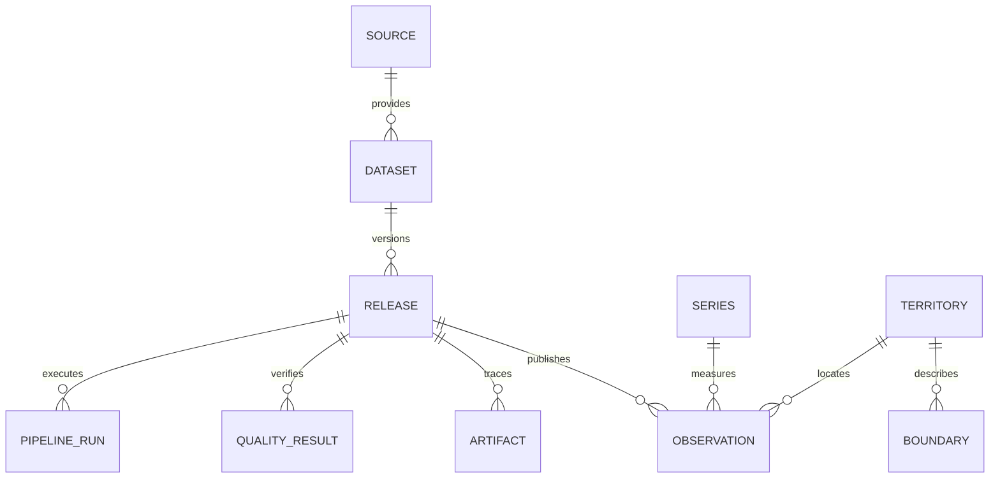

# Modello dati della v0.1

Il DDL autorevole è nelle revisioni `migrations/sql/0001_foundation.sql` e
`0002_istat_publication.sql`; l'upgrade è gestito da Alembic.
Non usare ORM autogenerate come sostituto della revisione delle migrazioni.

- `catalog.source`: ente e riferimenti generali; il catalogo non attesta importazione.
- `catalog.dataset`: significato, limiti e fonte; demo e popolazione regionale ISTAT.
- `catalog.release`: contenuto originale, checksum del contratto, versione della
  trasformazione, URL, acquisizione, periodo, licenza, conteggio e stato di pubblicazione.
  Il periodo descrive il campione demo monoperiodo; dataset reali multitemporali richiederanno
  intervalli di copertura espliciti e un contratto adeguato.
  La revisione 0002 aggiunge fingerprint dei metadati, serie, versione API, snapshot
  territoriale, attribuzione, date upstream nullable e predecessore/motivazione.
  FK composite e unicità assicurano una catena lineare nello stesso dataset/periodo;
  il predecessore deve essere pubblicato. Aggiornamento dataflow e pubblicazione
  upstream sono campi distinti. Nel primo dataset la seconda data non è accertata.
- `catalog.artifact`: manifest di originali, Parquet e report; hash e dimensione dei file.
  La release ISTAT traccia 12 artefatti: raw, Parquet, quality, DSD/codelist, dataflow,
  due contratti, tre manifest di acquisizione, evidenza licenza e report onboarding.
- `catalog.pipeline_run`: esito e tempi di ogni esecuzione; errori senza valori sensibili.
- `catalog.quality_result`: esiti verificabili per release; le API li rendono consultabili.
- `geo.territory`: chiave surrogata bigint, codice testuale che preserva zeri iniziali,
  schema, livello e periodo `[valid_from, valid_to)`. Un codice ISTAT non equivale a un
  identificatore eterno. I codici demo hanno namespace `ITADB_DEMO`.
- `geo.boundary`: geometria MultiPolygon EPSG:4326, versione e indice GiST. Nessuna
  geometria inventata viene caricata. Una geometria per territorio e release.
- `stats.series`: significato della misura, unità e dimensioni canoniche condivise;
  JSONB solo qui per metadati di serie, non per ogni osservazione.
- `stats.observation`: fatto numerico con stato esplicito. Mancante/soppresso implica null;
  zero è un dato. Numeric(20,6) evita arrotondamenti binari ma la sua scala è un limite
  contrattuale: non usarla silenziosamente per grandezze con precisione diversa.
  ISTAT senza flag usa `unflagged_upstream`, senza inferire osservazione diretta.
  Flag, nota territoriale, unità e moltiplicatore upstream sono colonne testuali;
  gli attributi completi sono conservati nel raw e nel report di onboarding.
  Il gate di pubblicazione limita il conteggio intero a meno di 10^14 per Numeric(20,6).

La chiave release+serie+periodo+territorio previene doppioni. FK e check proteggono
integrità referenziale e valori non finiti; le regole demografiche restano nel contratto
specifico della misura (un tasso di variazione può essere negativo, una popolazione no).

Le osservazioni pubblicate, i loro artefatti e controlli non sono modificabili. Le dimensioni
già referenziate non vengono aggiornate in place: produrre una nuova versione/codifica.
Il ruolo API legge solo le viste `api.*`. La pipeline usa ancora il ruolo owner nello
scaffold: un ruolo writer con grant minimi è un requisito prima della produzione.
I proprietari/superuser possono cambiare trigger o troncare tabelle; immutabilità applicativa
non significa storage WORM contro amministratori privilegiati.

Per il campione ISTAT sono implementati vincolo anti-sovrapposizione GiST con `btree_gist`,
gerarchia e contenimento temporale padre/figlio, e controllo della data dell'osservazione.
Lo snapshot ha validità `[2024-01-01,2024-01-02)`: attesta solo la data verificata.
Il namespace incorpora schema fonte, data e hash della definizione territoriale;
revisioni numeriche riusano i territori, una definizione modificata ne crea una nuova versione.
Italia è padre delle regioni selezionate; le province autonome non sono incluse insieme a ITDA.
Fusioni/scissioni, crosswalk e confini storici restano in M2, prima di estendere il perimetro.
