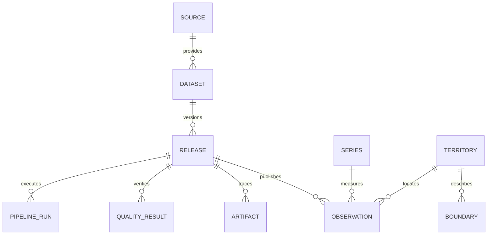

# Modello dati della v0.1

Il DDL autorevole è `migrations/sql/0001_foundation.sql`; l'upgrade è gestito da Alembic.
Non usare ORM autogenerate come sostituto della revisione delle migrazioni.

- `catalog.source`: ente e riferimenti generali; il catalogo non attesta importazione.
- `catalog.dataset`: significato, limiti e fonte. La v0.1 crea solo il dataset demo.
- `catalog.release`: contenuto originale, checksum del contratto, versione della
  trasformazione, URL, acquisizione, periodo, licenza, conteggio e stato di pubblicazione.
  Il periodo descrive il campione demo monoperiodo; dataset reali multitemporali richiederanno
  intervalli di copertura espliciti e un contratto adeguato.
- `catalog.artifact`: manifest di originali, Parquet e report; hash e dimensione dei file.
- `catalog.pipeline_run`: esito e tempi di ogni esecuzione; errori senza valori sensibili.
- `catalog.quality_result`: esiti verificabili per release; le API li rendono consultabili.
- `geo.territory`: chiave surrogata bigint, codice testuale che preserva zeri iniziali,
  schema, livello e periodo `[valid_from, valid_to)`. Un codice ISTAT non equivale a un
  identificatore eterno. I codici demo hanno namespace `ITADB_DEMO`.
- `geo.boundary`: geometria MultiPolygon EPSG:4326, versione e indice GiST. Nessuna
  geometria inventata viene caricata. Una geometria per territorio e release.
- `stats.series`: significato della misura, unità e dimensioni canoniche condivise;
  JSONB solo qui per metadati di serie, non per ogni osservazione.
- `stats.observation`: fatto numerico con stato esplicito. Mancante/soppresso implica null;
  zero è un dato. Numeric(20,6) evita arrotondamenti binari ma la sua scala è un limite
  contrattuale: non usarla silenziosamente per grandezze con precisione diversa.

La chiave release+serie+periodo+territorio previene doppioni. FK e check proteggono
integrità referenziale e valori non finiti; le regole demografiche restano nel contratto
specifico della misura (un tasso di variazione può essere negativo, una popolazione no).

Le osservazioni pubblicate, i loro artefatti e controlli non sono modificabili. Le dimensioni
già referenziate non vengono aggiornate in place: produrre una nuova versione/codifica.
Il ruolo API legge solo le viste `api.*`. La pipeline usa ancora il ruolo owner nello
scaffold: un ruolo writer con grant minimi è un requisito prima della produzione.
I proprietari/superuser possono cambiare trigger o troncare tabelle; immutabilità applicativa
non significa storage WORM contro amministratori privilegiati.

Prima di importare territori reali: implementare vincoli anti-sovrapposizione temporale,
mapping fusioni/scissioni, versioni di gerarchie, controlli di validità dei codici nel periodo
osservato e convenzioni delle serie. La presenza delle colonne non attesta questi controlli.

